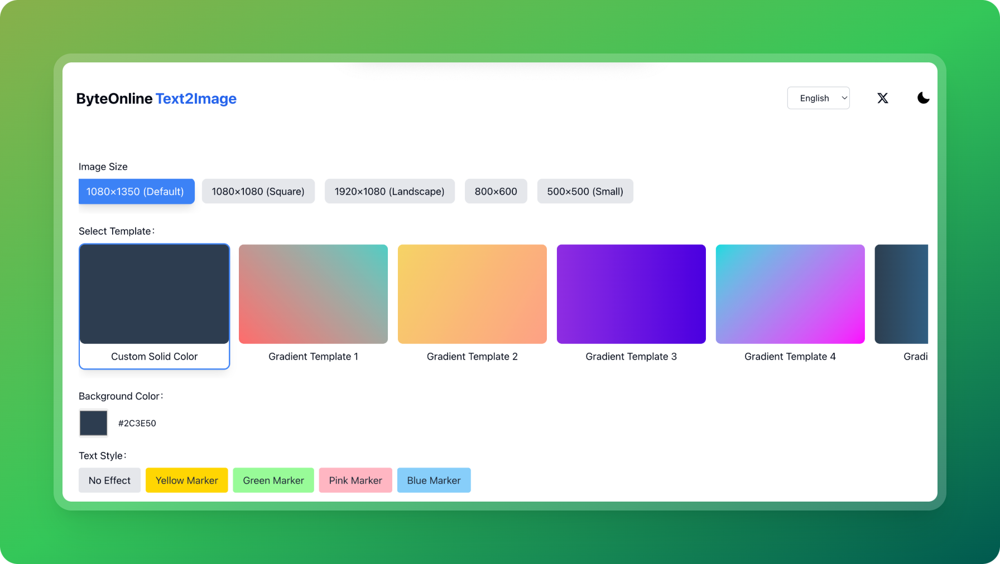

# 文字转图片生成器

一个基于 Next.js 14+ 和 TypeScript 构建的现代网页应用，可以将文字转换成精美的图片，支持自定义样式和模板。

⭐ 如果您觉得这个项目有用，请考虑在 GitHub 上给我们一个星标！您的支持将帮助我们不断改进这个项目。

[English](README.md) | [中文](README-zh.md)



## 特性

- 🎨 多种背景模板（纯色、渐变、图案）
- 🖌️ 文字马克笔高亮效果
- 📏 多种图片尺寸选项
- 🌓 明暗主题切换
- 🌍 国际化支持（中文和英文）
- 📊 集成 Google Analytics
- 💅 使用 Tailwind CSS 构建的响应式设计

## 演示

访问 [https://text-image.tool.vin](https://text-image.tool.vin) 查看在线演示。

## 快速开始

### Vercel 部署

[](https://vercel.com/new/clone?repository-url=https://github.com/shadowDragons/byte-text-image-generator)

### 本地开发

1. 克隆仓库

```bash
git clone https://github.com/shadowDragons/byte-text-image-generator.git
cd byte-text-image-generator
```

2. 安装依赖

```bash
npm install
# 或
yarn install
# 或
pnpm install
```

3. 创建环境变量文件

```bash
cp .env.example .env.local
```

4. 启 开发服务器

```bash
npm run dev
# 或
yarn dev
# 或
pnpm dev
```

在浏览器中打开 [http://localhost:3000](http://localhost:3000) 查看结果。

## 环境变量

在根目录创建 `.env.local` 文件，包含以下变量：

```env
NEXT_PUBLIC_GA_ID=你的GA跟踪ID
```

## 技术栈

- [Next.js 14](https://nextjs.org/) - React 框架
- [TypeScript](https://www.typescriptlang.org/) - 类型安全
- [Tailwind CSS](https://tailwindcss.com/) - 样式框架
- [next-intl](https://next-intl-docs.vercel.app/) - 国际化
- [next-themes](https://github.com/pacocoursey/next-themes) - 主题管理

## 项目结构

```
.
├── app/                    # Next.js 应用目录
├── components/            # React 组件
├── config/               # 站点配置
├── lib/                  # 工具函数
├── messages/             # 国际化翻译文件
├── public/              # 静态资源
└── styles/              # 全局样式
```

## 贡献

欢迎提交 Pull Request！

## 许可证

本项目采用 MIT 许可证 - 查看 [LICENSE](LICENSE) 文件了解详情。

## 作者

Junexus ([https://byte.ink](https://byte.ink))

## 支持项目

如果这个项目对您有帮助，可以请我喝杯咖啡：

[](https://byte.ink/zh/sponsor)

## 开发计划

- [ ] 社交媒体卡片
- [ ] 文章封面图
- [ ] 多字体支持
- [ ] 表情符号支持

## 致谢

- [Next.js](https://nextjs.org/)
- [Tailwind CSS](https://tailwindcss.com/)
- [next-intl](https://next-intl-docs.vercel.app/)
