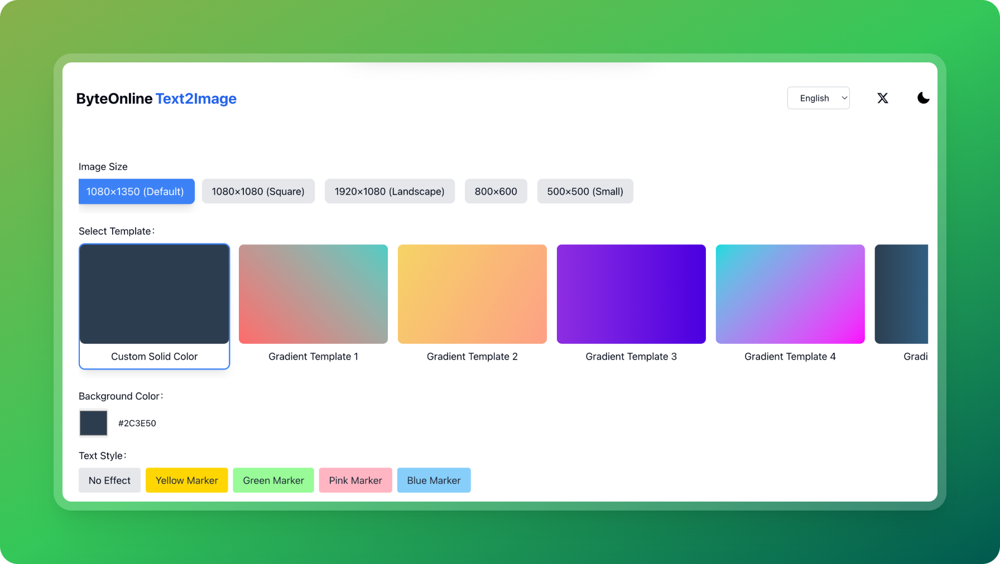

# Text to Image Generator

A modern web application that converts text into beautiful images with customizable styles and templates. Built with Next.js 14+ and TypeScript.

⭐ If you find this project useful, please consider giving it a star on GitHub! Your support helps us grow and improve the project.

[English](README.md) | [中文](README-zh.md)



## Features

- 🎨 Multiple background templates (solid colors, gradients, patterns)
- 🖌️ Text highlighting with marker effects
- 📏 Multiple image size options
- 🌓 Dark/Light mode support
- 🌍 i18n support (English & Chinese)
- 📊 Google Analytics integration
- 💅 Responsive design with Tailwind CSS

## Demo

Visit [https://text-image.tool.vin](https://text-image.tool.vin) to see the live demo.

## Quick Start

### Deploy on Vercel

[](https://vercel.com/new/clone?repository-url=https://github.com/shadowDragons/text2image)

### Local Development

1. Clone the repository

```bash
git clone https://github.com/shadowDragons/text-to-image.git
cd text-to-image
```

2. Install dependencies

```bash
npm install
or
yarn install
or
pnpm install
```

3. Create environment variables file

```bash
cp .env.example .env.local
```

4. Start the development server

```bash
npm run dev
or
yarn dev
or
pnpm dev
```

Open [http://localhost:3000](http://localhost:3000) with your browser to see the result.

## Environment Variables

Create a `.env.local` file in the root directory with the following variables:

```env
NEXT_PUBLIC_GA_ID=your-ga-id
```

## Tech Stack

- [Next.js 14](https://nextjs.org/) - React framework
- [TypeScript](https://www.typescriptlang.org/) - Type safety
- [Tailwind CSS](https://tailwindcss.com/) - Styling
- [next-intl](https://next-intl-docs.vercel.app/) - Internationalization
- [next-themes](https://github.com/pacocoursey/next-themes) - Theme management

## Project Structure

```
.
├── app/ # Next.js app directory
├── components/ # React components
├── config/ # Site configuration
├── lib/ # Utility functions
├── messages/ # i18n translation files
├── public/ # Static assets
└── styles/ # Global styles
```

## Contributing

Contributions are welcome! Please feel free to submit a Pull Request.

## License

This project is licensed under the MIT License - see the [LICENSE](LICENSE) file for details.

## Author

Junexus ([https://byte.ink](https://byte.ink))

## Roadmap

- [ ] Social Media Cards
- [ ] Article Covers
- [ ] Multiple Font Support
- [ ] Emoji Support

## Acknowledgments

- [Next.js](https://nextjs.org/)
- [Tailwind CSS](https://tailwindcss.com/)
- [next-intl](https://next-intl-docs.vercel.app/)
